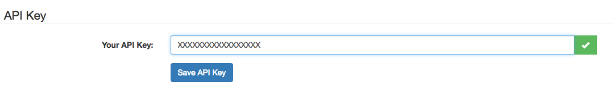

# Movies Web (Angular)

This project is a demo to show the use of angular using some of its features:

- Controllers
- Directives
- Routing
- Services

It also shows the use of:
 - Some higher order functions
 - Promises
 - LocalStorage

It can be seen online at: http://juanmaguitar.github.io/movies-angular

## The API Key

This site uses https://www.themoviedb.org/ to retrieve the data so to use it **you have to enter (& save) a valid API Key**

You can get one by registering in the site and adding a new API Key.

The doc of the API is at: http://docs.themoviedb.apiary.io/

